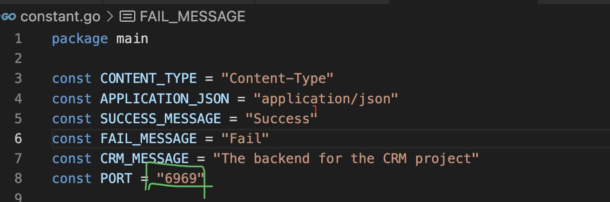
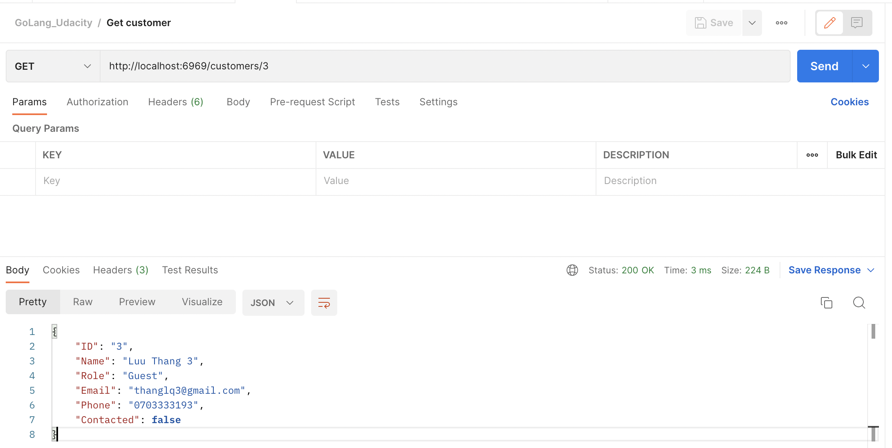
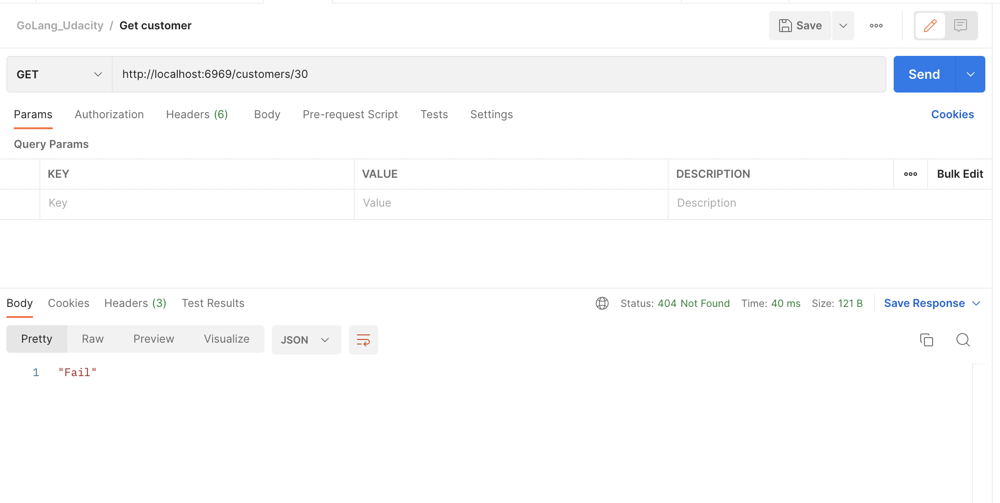
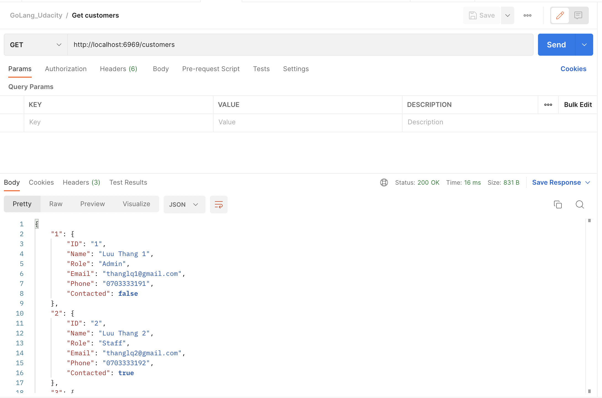
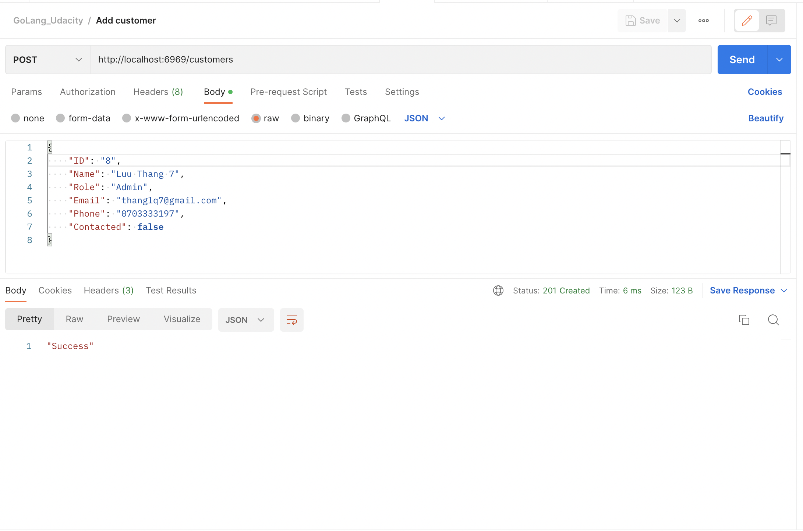
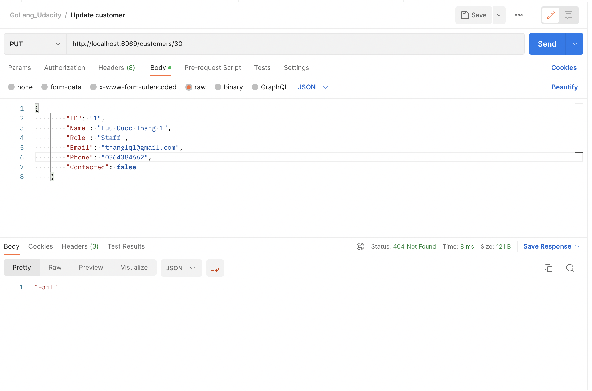
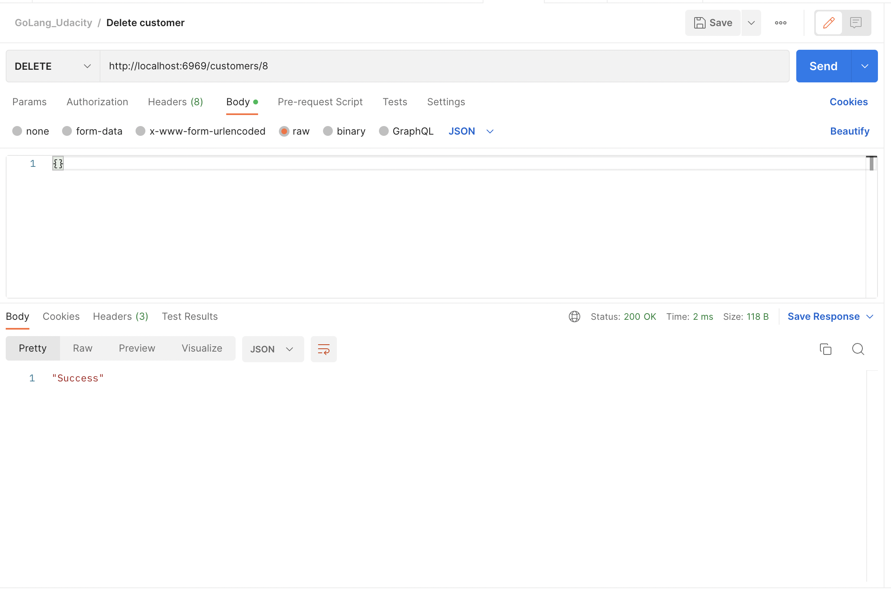
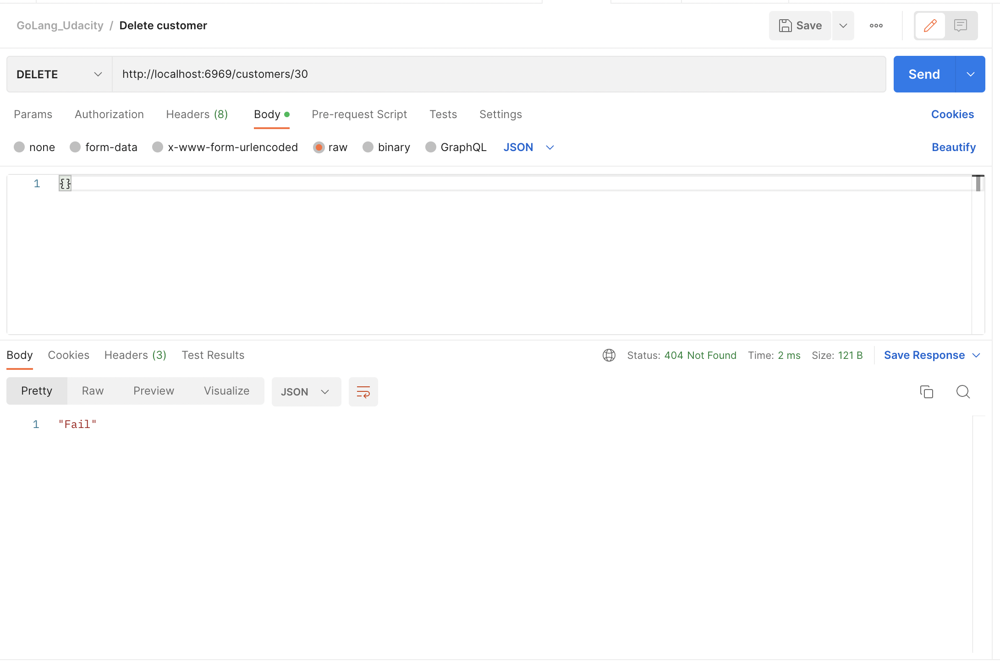

# Config before run
- Change port: You can change value of the Port variable

# How to run
## Using Visual Code
- Open Visual Code IDE
- Click Terminal in Menubar -> Select New Terminar(Or using hotkey(MacOS): "control + `")
## Run using command
- Run the `go get github.com/gorilla/mux`
- Run the `go run .`
## Result

# Testing
- You can test using Postman tool
- First step: Import GoLang_Udacity.postman_collection.json to Postman tool
- Result:
  - 
  - 
  - 
  - 
  - 
  - 
  - 
  - 
  - 

